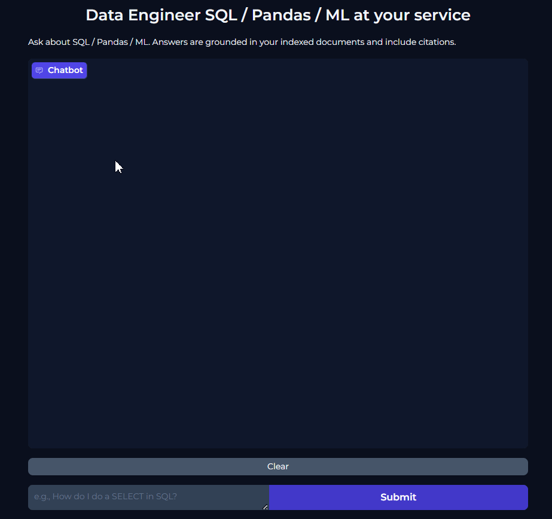

## DataDocChatbot

DataDocChatbot is a fully custom Retrieval-Augmented Generation (RAG) assistant built without LangChain, meaning all internal steps (OCR, chunking, embeddings, vector search, prompt-building, inference) were engineered manually.

It allows a user to ask natural language questions about private PDF documents (SQL manuals, Data Engineering books, Pandas references, MLflow documentation, etc.) including scanned PDFs and returns grounded answers with verifiable citations.

The chatbot reads, processes, and understands entire documents with or without images stored locally, then uses a combination of semantic search + LLM reasoning to answer the user.
---

##What makes this projects unique ?

Unlike many RAG projects that rely on LangChain abstractions, every stage is built from scratch, which demonstrates a deeper engineering understanding:

- OCR reading for scanned PDFs
- Manual chunking strategy
- Mathematical vector embeddings
- Direct Pinecone API usage (no wrapper)
- Prompt engineering
- LLM inference using Groq (Llama-3.1-8B)
- Gradio interface with streaming responses

This gives full control over the pipeline, nothing is “magic”.
---

## Architecture

```
PDFs (docs/)
     |
[PyMuPDF + Tesseract OCR]
     |
     v
Normalize + Chunk  --->  chunks.jsonl
     |                       |
     v                       v
 [Sentence Transformers]   [Question embedding]
      |                           |
      v                           v
   Pinecone Upsert <--- Pinecone Query (top_k)
      |
      v
   RAG Prompt → Groq (Llama-3.1-8B) → Final Answer + Citations
```

---

## Mathematics Used

> **Tip for GitHub READMEs:** use `$...$` for inline math and `$$...$$` for display math.

---

### Sentence Embeddings

Each text chunk $t$ becomes a 384-dimensional semantic vector:

$$
e(t) \in \mathbb{R}^{384}
$$

All embeddings are L2-normalized:

$$
\lVert e \rVert_2 = 1 \quad \Longrightarrow \quad \sum_{i=1}^{384} e_i^2 = 1
$$

This makes cosine similarity equal to the dot product. Based on Cauchy-Schwartz' inequality

---

### Cosine Similarity

Given question embedding $q$ and chunk embedding $e$:

$$
\cos(\theta) = \frac{q \cdot e}{\lVert q \rVert \, \lVert e \rVert}
$$

With normalized vectors:

$$
\cos(\theta) = q \cdot e
$$

Higher score ⇒ more relevant chunk. Pinecone ranks results with this metric.

---

### Overlapping Chunking

Splitting text into fixed-size chunks can break sentences across boundaries.  
To preserve context, overlapping windows are used (e.g., 900 words, overlap 120).  
This increases recall and improves retrieval accuracy.

---

### Stable Vector IDs

Each vector uses a SHA-1 hash of `(doc || page || text)`:

$$
ID = \mathrm{SHA1}(\text{doc} \,||\, \text{page} \,||\, \text{text})
$$

This prevents duplicates and makes ingestion idempotent.

---

## Project Files

| File | Purpose |
|------|---------|
| `chunky_cut.py` | PDF → OCR → chunking → `.jsonl` |
| `embedding.py` | JSONL → embeddings → Pinecone upsert |
| `retrivial_question.py` | Retrieval debug (top‑k check) |
| `rag_answers.py` | Full RAG: retrieval + Groq + citations |
| `app.py` | Gradio chat UI (streaming) |

---

## Installation

```bash
python -m venv chatbot
source chatbot/Scripts/activate       # Windows: .\chatbot\Scripts\activate

pip install -U pip
pip install -U gradio==4.44.1 gradio_client
pip install sentence-transformers pinecone-client groq python-dotenv pymupdf pytesseract pillow
```

Create `.env`:

```
PINECONE_API_KEY=your_key
PINECONE_INDEX=rag-data
PINECONE_NAMESPACE=data_docs
GROQ_API_KEY=your_key
```

Windows OCR (if Tesseract not in PATH):

```python
pytesseract.pytesseract.tesseract_cmd = r"C:\Program Files\Tesseract-OCR\tesseract.exe"
```

---

## Running the Pipeline

### PDF → chunks.jsonl
```bash
python chunky_cut.py
```

### Embeddings → Pinecone
```bash
python embedding.py
```

### Test retrieval
```bash
python retrivial_question.py
```

### Launch chatbot
```bash
python app.py
```

---

## Troubleshooting

| Issue | Fix |
|-------|-----|
| `TesseractNotFoundError` | Install Tesseract or set explicit path |
| Empty retrieval results | Check namespace + ingestion done |
| Gradio schema error | `pip install -U gradio==4.44.1` |
| Localhost blocked | launch with `server_name="127.0.0.1"` |

---

## Security

- Do **not** commit `.env` to Git
- Rotate API keys if exposed
- Separate Pinecone namespaces for dev/prod

---

## License

MIT — see `LICENSE`

---

## Acknowledgments

- Sentence Transformers  
- Pinecone  
- Groq (Llama‑3.1)  
- Gradio  
- PyMuPDF & Tesseract OCR

## Conclusion

A project carried out with dedication and commitment to unveil the secrets of RAGS and agents to acquire a solid foundation of the domain, and ready to bring it forth to a larger scale





